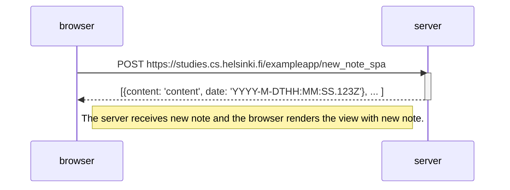

```mermaid
sequenceDiagram
    participant browser
    participant server
    
    browser->>server: POST https://studies.cs.helsinki.fi/exampleapp/new_note_spa
    activate server
    server-->>browser:  [{content: 'content', date: 'YYYY-M-DTHH:MM:SS.123Z'}, ... ]
    deactivate server

    Note right of browser: The server receives new note and the browser renders the view with new note.
```
